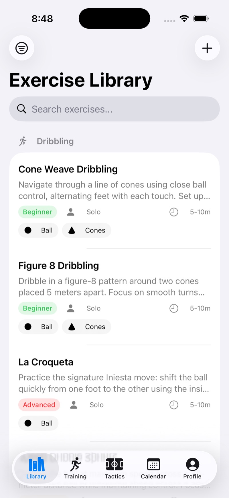
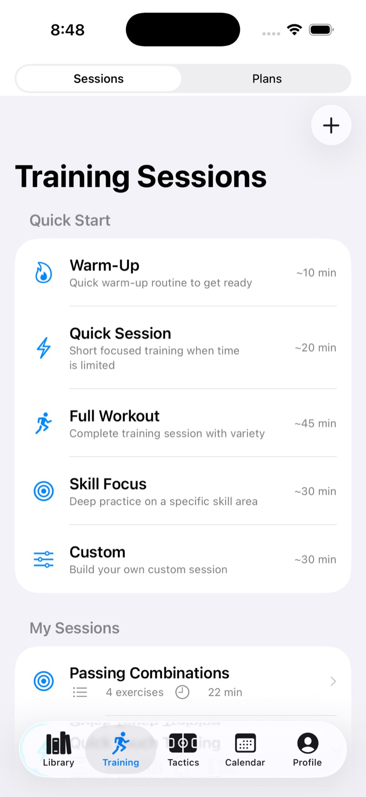
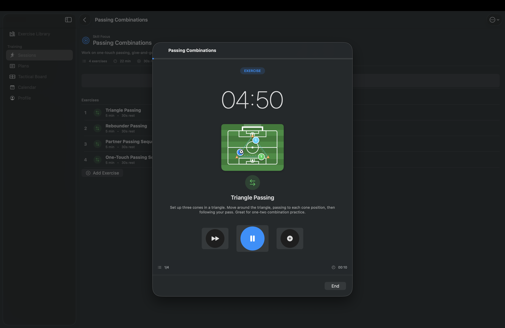
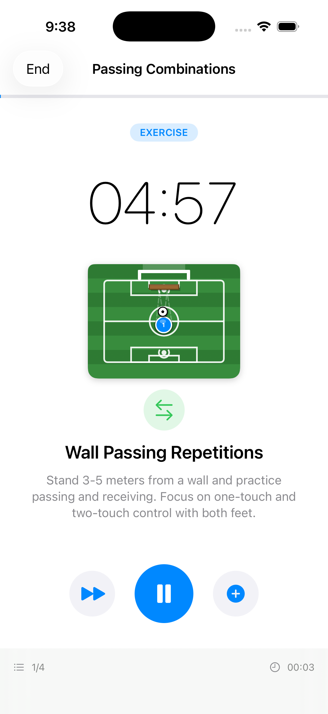
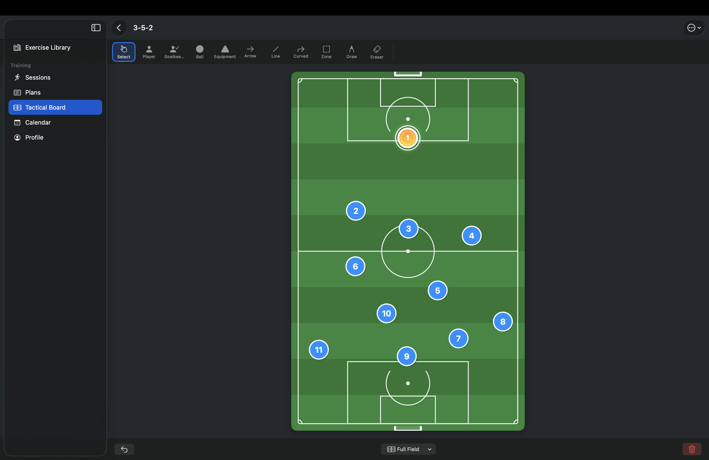
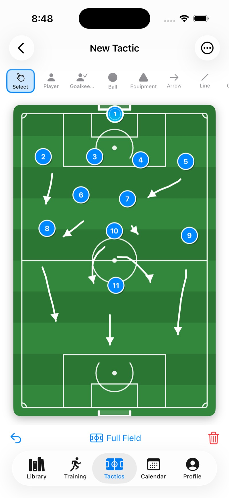
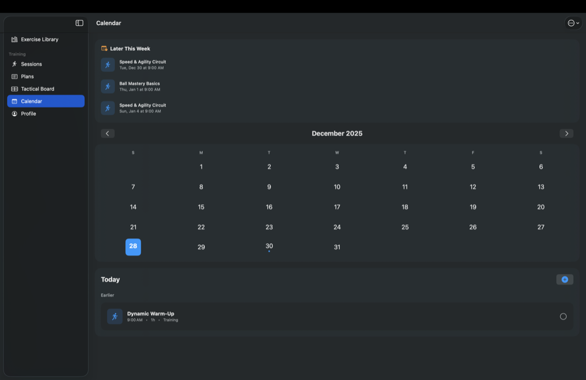
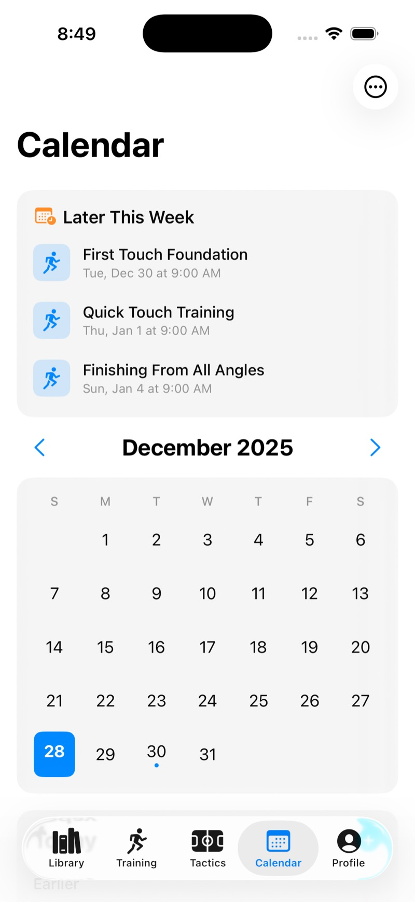
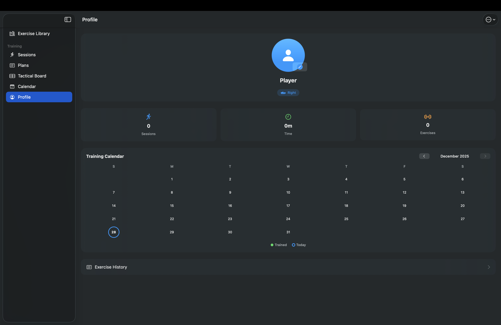
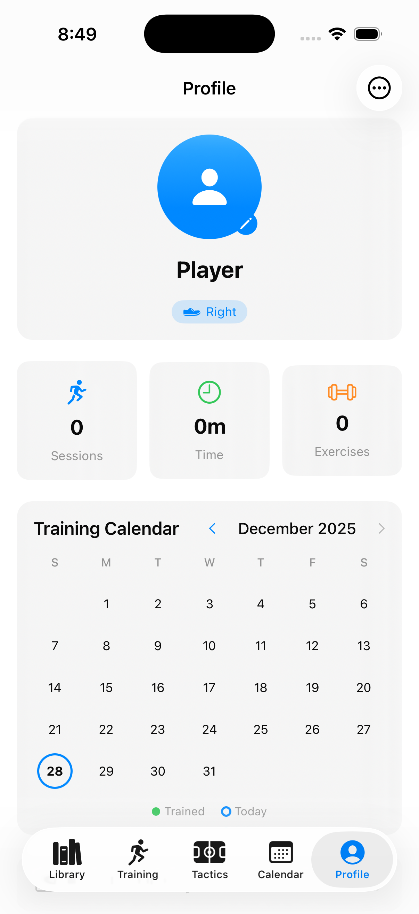

# Trapattoni

A native iOS and macOS app for football training⚽️. Build custom training sessions, follow structured plans, draw tactics, and track your progress.

Named after Giovanni Trapattoni, the legendary Italian football manager.

[](LICENSE) [](#)

## Table of Contents

- [Why use this app?](#why-use-this-app)
- [Features](#features)
- [Screenshots](#screenshots)
- [Build & Run](#build--run)
- [How to use (quick)](#how-to-use-quick)
- [Contributing](#contributing)
- [License](#license)

## Why use this app?

- Focused, football-specific training templates for all levels.
- Combine tactical drawing and session execution in one native app.
- Offline-first local persistence with SwiftData — your data stays on device.
- Multi-language support: English, Spanish, and Portuguese.

## Features

### Exercise Library
Browse and search a curated library of football exercises:
- **Categories**: Dribbling, Passing, Shooting, First Touch, Fitness & Conditioning, Goalkeeping, Defending, Set Pieces
- **Skill Levels**: Beginner, Intermediate, Advanced
- **Training Types**: Solo, Partner, Team
- **Equipment Tracking**: Ball, Cones, Goal, Wall, Agility Ladder, and more
- Filter by duration, space required, and favorites
- Add your own custom exercises with video links and coaching points

### Training Sessions
Create and execute structured training sessions:
- Build sessions from library exercises or your own
- Set duration and rest intervals per exercise
- Execute sessions with built-in timers
- Rate exercises after completion
- Schedule sessions to your calendar

### Training Plans
Follow multi-week training programs:
- 8 prebuilt starter plans for all skill levels
- Create custom plans with your sessions
- Track weekly progress and completion
- Pause, resume, or restart plans anytime

**Included Starter Plans:**
- Beginner Fundamentals (4 weeks)
- Ball Control Basics (4 weeks)
- Complete Skills Development (6 weeks)
- Attacking Player Development (5 weeks)
- Elite Skills Mastery (6 weeks)
- Match Performance (4 weeks)
- Speed & Agility Focus (6 weeks)
- Strength & Conditioning (6 weeks)

### Tactical Board
Draw formations and tactics on a football pitch:
- Full-pitch or half-pitch view
- Drag and drop players (home/away teams)
- Add cones, balls, and custom markers
- Draw movement paths and arrows
- Save and organize multiple tactic sheets

### Calendar
Schedule and manage your training:
- View activities by day, week overview
- Schedule sessions and plans
- Recurring activities support
- Push notifications for training reminders

### Progress Tracking
Monitor your training consistency:
- Training streak tracking
- Sessions completed stats
- Time trained metrics
- Category breakdown charts
- Exercise history and ratings

### Multi-Language Support
The app is fully localized in three languages:
- **English** (default)
- **Spanish** (Español)
- **Portuguese** (Português)

All content updates instantly when you change the language in Settings — no restart required. This includes:
- All UI labels and buttons
- Exercise names and descriptions (50+ exercises)
- Training session templates
- Training plan names and descriptions
- Categories, skill levels, and equipment names

### Feature screenshots (macOS | iOS)

Below are side-by-side screenshots demonstrating key areas of the app on macOS (left) and iOS (right).

<table>
    <tr>
        <th align="center">macOS</th>
        <th align="center">iOS</th>
    </tr>
    <tr>
        <td align="center">
            <br>
            <strong>Exercise Library</strong>
        </td>
        <td align="center">
            <br>
            <strong>Exercise Library</strong>
        </td>
    </tr>
    <tr>
        <td align="center">
            <br>
            <strong>Training Sessions</strong>
        </td>
        <td align="center">
            <br>
            <strong>Training Sessions</strong>
        </td>
    </tr>
     <tr>
        <td align="center">
            <br>
            <strong>Session Execution</strong>
        </td>
        <td align="center">
            <br>
            <strong>Session Execution</strong>
        </td>
    </tr>
    <tr>
        <td align="center">
            <br>
            <strong>Tactical board</strong>
        </td>
        <td align="center">
            <br>
            <strong>Tactical board</strong>
        </td>
    </tr>
    <tr>
        <td align="center">
            <br>
            <strong>Calendar / Plan</strong>
        </td>
        <td align="center">
            <br>
            <strong>Calendar / Plan</strong>
        </td>
    </tr>
    <tr>
        <td align="center">
            <br>
            <strong>Player Profile</strong>
        </td>
        <td align="center">
            <br>
            <strong>Player Profile</strong>
        </td>
    </tr>
</table>

> Screenshots are stored in the `screenshots/` folder — replace them with newer captures to update visuals.

## Requirements

- **iOS**: 17.0+
- **macOS**: 14.0+ (Sonoma)
- **Xcode**: 15.0+

## Build & Run

1. Clone the repository:
```bash
git clone https://github.com/yourusername/trapattoni.git
cd trapattoni
```

2. Open in Xcode:
```bash
open trapattoni.xcodeproj
```

3. Select your target device (iPhone, iPad, or Mac)

4. Build and run (⌘R)

No external dependencies. The app uses only Apple frameworks.

## Project Structure

```
trapattoni/
├── trapattoniApp.swift          # App entry point
├── ContentView.swift            # Tab/sidebar navigation
├── Models/
│   ├── Exercise.swift           # Exercise data model
│   ├── TrainingSession.swift    # Session model
│   ├── TrainingPlan.swift       # Multi-week plan model
│   ├── TacticSheet.swift        # Tactical board model
│   ├── ScheduledActivity.swift  # Calendar activity model
│   ├── PlayerProfile.swift      # User profile
│   └── ...
├── Views/
│   ├── ExerciseLibrary/         # Browse and filter exercises
│   ├── SessionBuilder/          # Create and run sessions
│   ├── TrainingPlans/           # Plan management
│   ├── TacticalBoard/           # Tactics drawing canvas
│   ├── Calendar/                # Scheduling views
│   ├── Profile/                 # User profile and stats
│   └── Components/              # Reusable UI components
├── Services/
│   ├── ExerciseDataSeeder.swift # Seeds initial exercises
│   ├── PlanDataSeeder.swift     # Seeds starter plans
│   ├── LocalizationManager.swift# Multi-language support (EN/ES/PT)
│   ├── NotificationService.swift# Push notifications
│   └── StatsService.swift       # Statistics calculations
└── Extensions/
    └── Color+CrossPlatform.swift # iOS/macOS color compatibility
```

## Data Storage

The app uses SwiftData for local persistence. All data is stored on-device.

**Reset app data** (useful for development):
```bash
# macOS sandboxed app
rm -rf ~/Library/Containers/com.ks.trapattoni/Data/Library/Application\ Support/default.store*

# macOS debug build
rm -rf ~/Library/Application\ Support/default.store*
```

## Platform Differences

| Feature | iOS | macOS |
|---------|-----|-------|
| Navigation | Tab bar | Sidebar |
| Session Execution | Full screen | Sheet |
| Tactical Board | Touch gestures | Mouse/trackpad |
| Notifications | Supported | Supported |

## Architecture

- **SwiftUI**: Declarative UI framework
- **SwiftData**: Persistence layer (Core Data successor)
- **MVVM-ish**: Views with @Query and @Bindable for data flow
- **No external dependencies**: Pure Apple frameworks

## Contributing

1. Fork the repository
2. Create a feature branch (`git checkout -b feature/your-feature`)
3. Commit your changes (`git commit -m 'Add your feature'`)
4. Push to the branch (`git push origin feature/your-feature`)
5. Open a Pull Request

## License

MIT License. See [LICENSE](LICENSE) for details.

## Acknowledgments

- Named in honor of Giovanni Trapattoni's tactical legacy
